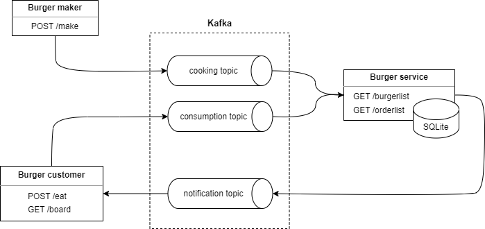
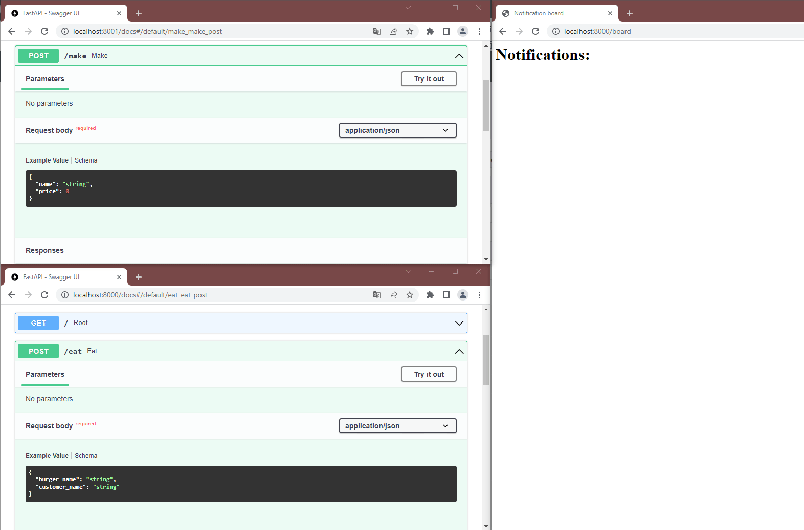

# Burger Joint

## Description
This is a demo project implementing Python microservices with Kafka as a message broker.  
Burger maker can cook burgers and burger customer can eat them. Every time a burger is cooked, bugrer service stores it and notifies the customer about new stuff.
Customer can try to order one, then the service will process the order, save it and give a feedback. Customer can see all the service's responses on the notification board.

## Application structure
### Infrastructure
Basic infrastructure on which the application is built. Described in docker-compose.yml file. Consists of following:
- **Kafka** - `wurstmeister/kafka` image for running Apache Kafka cluster in container
- **ZooKeeper** - `wurstmeister/zookeeper` image for running ZooKeeper in container
- **SQLite** - `nouchka/sqlite3` image with sqlite3 cli for accessing database (optional)

### burger_customer
A Python microservice with Web API built using `FastAPI`. Listens to **notification topic** and produces messages to **consumption topic**.
Uses `aiokafka` library for interaction with Kafka.

### burger_maker
A Python microservice with Web API built using `FastAPI`. Produces messages to **cooking topic**.
Uses `aiokafka` library for interaction with Kafka.

### burger_service
A Python microservice with Web API built using `FastAPI`. Subscribed to **cooking** and **comsumption** topics. Produces messages to **notification topic**.
Uses `aiokafka` library for interaction with Kafka and `SQLAlchemy` for querying database.

## Requirements
- `Python` 3.7+
- `Docker`
- `Docker-compose`

## Python requirements
Listed in requirements.txt files for each service in corresponding folders.
All requirements:
- `aiokafka`==0.8.0
- `fastapi`==0.95.0
- `SQLAlchemy`==2.0.7
- `pydantic`==1.10.7
- `sse_starlette`==1.3.3
- `starlette`==0.26.1
- `uvicorn`==0.21.1

## Usage
To launch application, simply run from project root:
```console
docker-compose up
```
Assuming your Docker Daemon running with default configuration, service API's should be available there:
- `http://localhost:8000` - burger customer
- `http://localhost:8001` - burger maker
- `http://localhost:8002` - burger service

You can navigate to `/docs` root for using Swagger docs and open `http://localhost:8000/board` to see customer's notification board.

## Application design diagram


## Example

